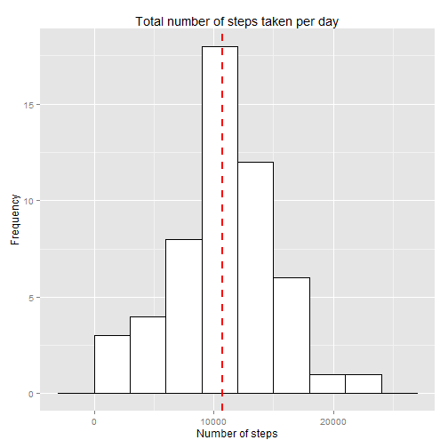
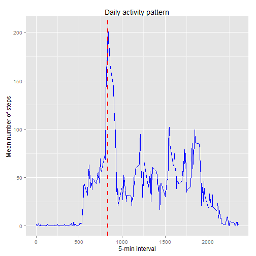
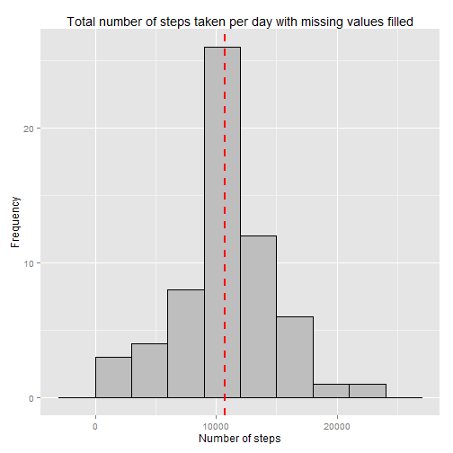
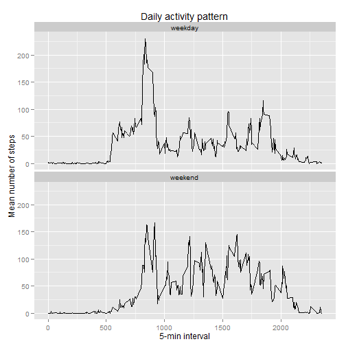

The assignment includes the analysis of data collected through a personal activity monitoring device. This device collects data at 5 minute intervals through out the day. The data consists of two months of activity from an anonymous person. 

The assignment will be answered in the order of the questions/tasks. 

**1. Loading and processing the data**


```r
setwd("D:/DataScience/WorkingDirectory")
data<-unzip("repdata-data-activity.zip")
data<-read.csv(data)
```

**2. What is mean total number of steps taken per day?**
For this part of the assignment, you can ignore the missing values in the dataset.


```r
library(plyr)
library(ggplot2)
data1<-data[!is.na(data$steps),]
data_by_date<-ddply(data1, c("date"), summarise, steps=sum(steps, na.rm=TRUE))
g<-ggplot(data_by_date, aes(x=steps))+geom_histogram(colour="black", fill="white", binwidth=3000)+ geom_vline(aes(xintercept=mean(steps, na.rm=T)), color="red", linetype="dashed", size=1) + labs(title="Total number of steps taken per day")+labs(y=expression("Frequency"), x=expression("Number of steps"))
mean<-mean(data_by_date$steps, na.rm=TRUE)
median<-median(data_by_date$steps, na.rm=TRUE)
g
```

 

The mean number of steps taken by the individual per day is 1.0766189 &times; 10<sup>4</sup>

The median number of steps taken by the individual per day is 10765

**3. What is the average daily activity pattern?**

3.1 Make a time series plot (i.e. type = "l") of the 5-minute interval (x-axis) and the average number of steps taken, averaged across all days (y-axis)


```r
data_by_interval<-ddply(data1, c("interval"), summarise, interval=mean(steps, na.rm=TRUE))
data_to_plot<-cbind(unique(data1$interval),data_by_interval)
max.value<-data_to_plot[data_to_plot$interval==max(data_to_plot$interval),]
g1<-ggplot(data = data_to_plot, aes(unique(data$interval), interval)) 
g1 + geom_line(colour="blue")  + labs(title="Daily activity pattern")+
    labs(y=expression("Mean number of steps"), x=expression("5-min interval")) +
    geom_vline(xintercept=as.numeric(max.value[1]), color="red", linetype="dashed", size=1)
```

 

3.2 Which 5-minute interval, on average across all the days in the dataset, contains the maximum number of steps?

The 5-min interval that has the maximum number of steps, on average across all the days in the dataset, is the interval 835

**4. Imputing missing values**

4.1.Calculate and report the total number of missing values in the dataset (i.e. the total number of rows with NAs)


```r
miss.val<-length(which(is.na(data$steps)))
```

The total number of missing vaflues is 2304

4.2 Devise a strategy for filling in all of the missing values in the dataset. The strategy does not need to be sophisticated. 
For example, you cou the mean/median for that day, or the mean for that 5-minute interval, etc.

4.3 Create a new dataset that is equal to the original dataset but with the missing data filled in.

In order to answer the question the missing values will be replaced by the average number of steps per interval.


```r
data2<-data
colnames(data_to_plot)[1]<-"interval.period"
colnames(data_to_plot)[2]<-"mean.steps.interval"
data2$steps[is.na(data2$steps)]<-data_to_plot$mean.steps.interval[match(data_to_plot$interval.period,data2$interval)]
```

4.4 Make a histogram of the total number of steps taken each day and Calculate and report the mean and median total number of steps taken per day. Do these values differ from the estimates from the first part of the assignment? What is the impact of imputing missing data on the estimates of the total daily number of steps?


```r
data_by_date2<-ddply(data2, c("date"), summarise, steps=sum(steps, na.rm=TRUE))
g2<-ggplot(data_by_date2, aes(x=steps))
g2+geom_histogram(colour="black", fill="gray", binwidth=3000)+ geom_vline(aes(xintercept=mean(steps, na.rm=T)), color="red", linetype="dashed", size=1) +
    labs(title="Total number of steps taken per day with missing values filled")+
    labs(y=expression("Frequency"), x=expression("Number of steps"))
```

 

```r
mean2<-mean(data_by_date2$steps, na.rm=TRUE)
median2<-median(data_by_date2$steps, na.rm=TRUE)
```

The mean number of steps taken by the individual per day is 1.0766189 &times; 10<sup>4</sup>

The median number of steps taken by the individual per day is 1.0766189 &times; 10<sup>4</sup>

Answering to questions, we can observe that the mean of total number of steps per day does not differ from the estimate in the first part of the assignment. However the number of the total daily steps increases when replacing the missing values, of course, because we are considering now information that was not presented before.

**5. Are there differences in activity patterns between weekdays and weekends?**

For this part the weekdays() function may be of some help here. Use the dataset with the filled-in missing values for this part.

5.1 Create a new factor variable in the dataset with two levels - "weekday" and "weekend" indicating whether a given date is a weekday or weekend day.

Firts we convert the class of the date column. From  "factor" to "date"

```r
data2$date <- as.Date(data2$date)
```

Now we must create a function that makes the distinction between a weekday and a weekend day


```r
fun <- function(date) {
    day <- weekdays(date)
    if (day %in% c("Monday", "Tuesday", "Wednesday", "Thursday", "Friday"))
        return("weekday")
    else if (day %in% c("Saturday", "Sunday"))
        return("weekend")
    }
```

Apply the function into the date set and create a column in the data with the missing values filled


```r
data2$day <- sapply(data2$date, FUN=fun)
```

5.2 Make a panel plot containing a time series plot (i.e. type = "l") of the 5-minute interval (x-axis) and the average number of steps taken, averaged across all weekday days or weekend days (y-axis). See the README file in the GitHub repository to see an example of what this plot should look like using simulated data.


```r
plot_days<-ddply(data2, c("day", "interval"), summarise, steps=mean(steps, na.rm=TRUE))
g3<-ggplot(data = plot_days, aes(interval, steps)) 

g3 + geom_line()  + labs(title="Daily activity pattern")+
    labs(y=expression("Mean number of steps"), x=expression("5-min interval")) + 
    facet_wrap(~ day, ncol=1)
```

 


